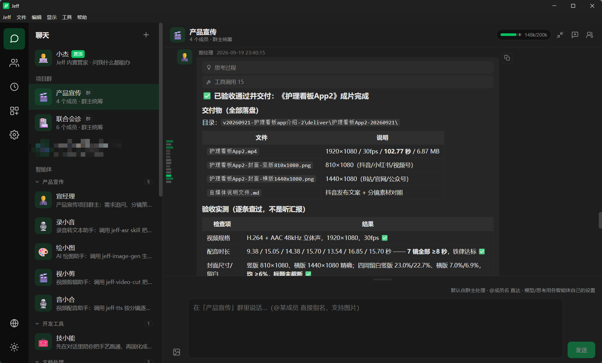
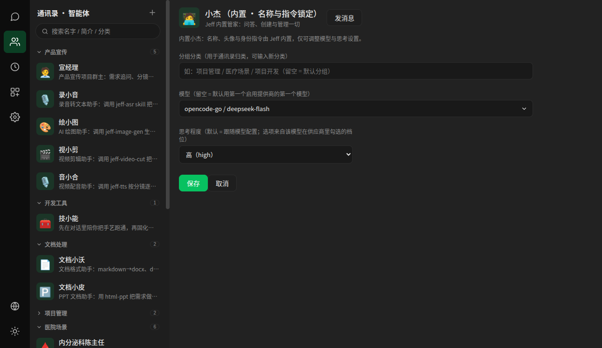
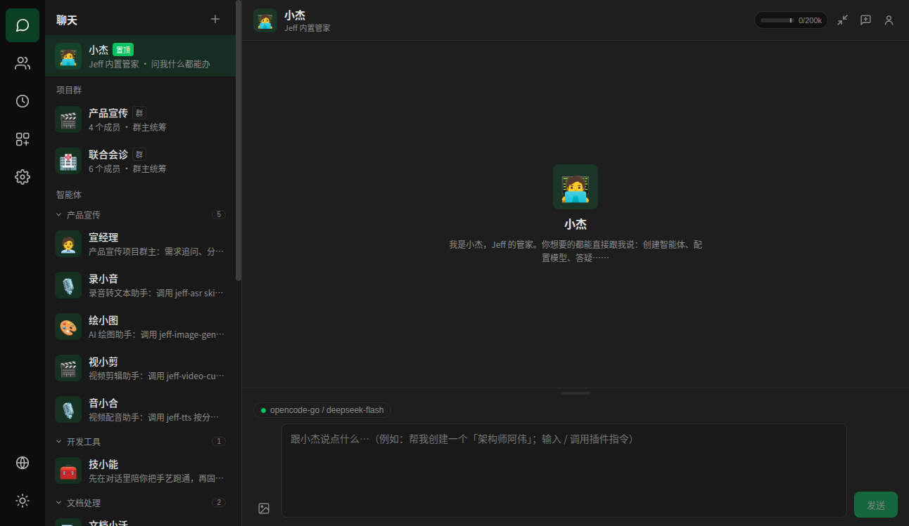
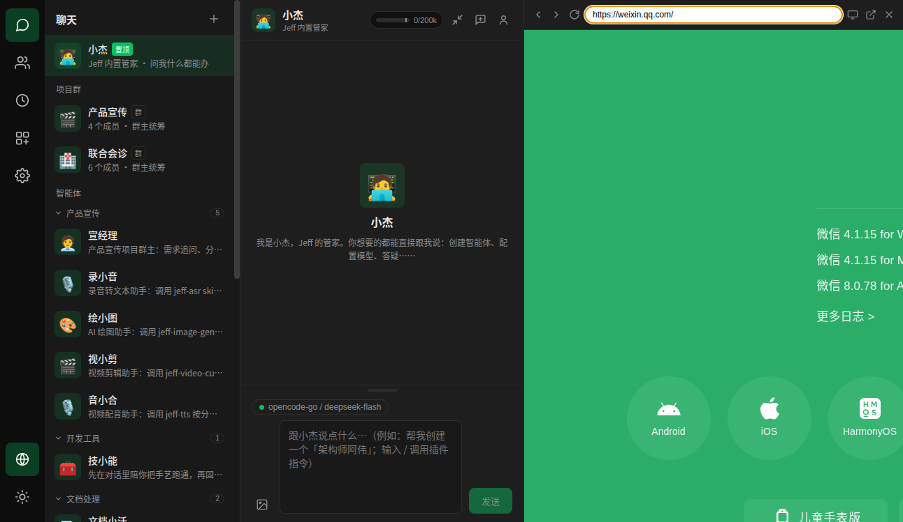

# Jeff

**Jeff = 你的 AI 团队。**  
私聊干一件事，群聊干一件复杂的事——像在微信里工作一样。

从一句话到可交付成果：

- **项目管理**：在群里把任务聊清楚，直到输出可以交付的 `.docx`
- **产品宣传**：从一个想法写脚本、配图配音，直到输出宣传片 `.mp4`

---

## 像微信一样用你的 AI 团队

### 项目群 · 产品宣传

从想法聊到验收通过的成片——群主统筹，成员各司其职。

### 智能体 = 你的 AI 团队

通讯录里按分工找人：宣传、录音、绘图、剪辑、配音、文档……都是可私聊的「同事」。

### 私聊 · 小杰

建团队、改配置、答疑——跟内置管家说一句就行。

### 内置浏览器

对话旁边打开网页（示意：微信官网），人与 AI 操作同一页。

---

## 获取与交流

版本迭代较快，安装包请直接联系获取；用法、演示、反馈也欢迎来聊。

扫码打开抖音，或搜索抖音号 **52611645463**（智慧病房-剑锋）：

---

代码与设计说明见本仓库 [`docs/`](docs/)。
