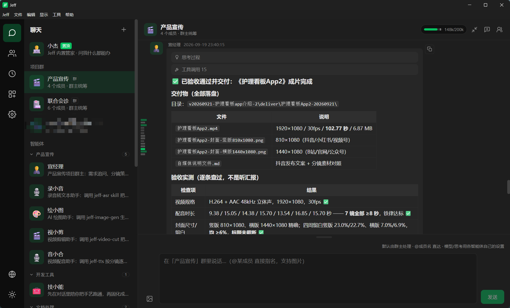
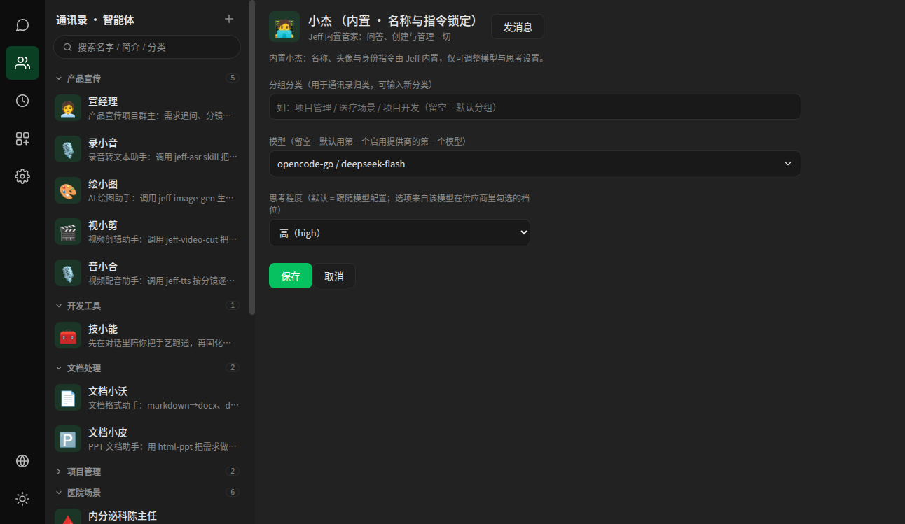
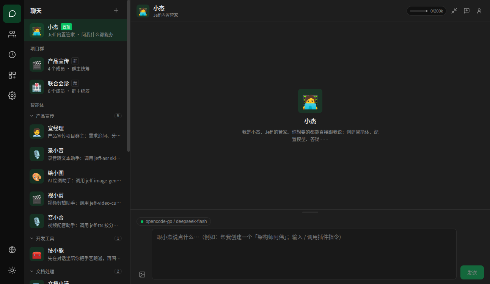
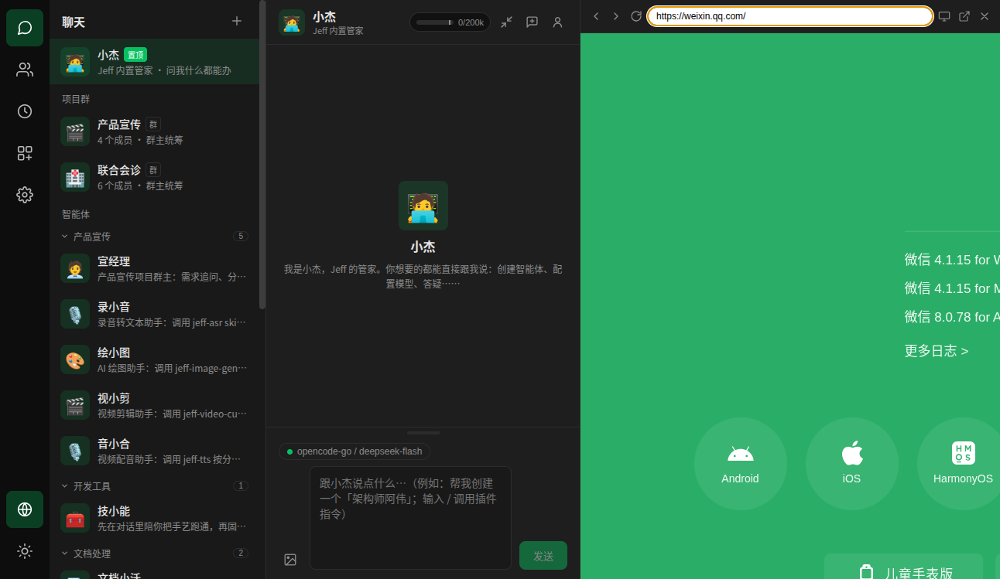
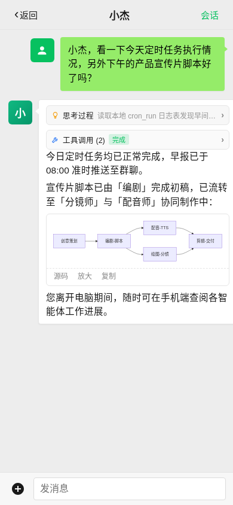

# Jeff

**Jeff = 你的 AI 团队。**  
私聊干一件事，群聊干一件复杂的事——像在微信里工作一样，随时随地调度你的专属 AI 团队。

从一句话想法到高质量交付成果：

- **项目管理**：在群里把需求聊清楚，自动拆解排期，直到输出可交付的专业 `.docx`
- **产品宣传**：从一个点子写脚本、画分镜、生成配音，直到多智能体协同输出成片 `.mp4`
- **自动化巡检**：定时任务后台自动巡检业务与数据，按时在群内汇报早晚报与异常结论

---

## 像微信一样用你的 AI 团队

### 项目群 · 产品宣传与复杂任务

从想法聊到验收通过的成片——群主（Leader）统筹全局，成员（Workers）各司其职，串行流水线闭环交付。

### 智能体 = 你的 AI 团队

通讯录里按分工找人：宣传、录音、绘图、剪辑、配音、文档、开发……都是可随时私聊的专业「同事」，支持分组分类与多模型/思考档位配置。

### 私聊 · 小杰管家

建团队、发起群聊、调度定时任务、开发插件、查阅记忆——跟内置管家说一句就行。

### 内置浏览器 · 人机同屏协作

对话框旁独立打开网页（支持自适应与精确分辨率），智能体具备自主导航、智能填表、文件上传、精准截图与控制台报错分析能力，人机同屏操作同一页面。

### 移动端遥控器 · 随时随地掌控进展

外出或离开电脑时，掏出手机即可无缝跟进：端到端加密（E2EE）安全直连桌面端，微信式交互体验，支持实时流式对话、思考链展开、工具调用跟踪，以及 Markdown 与 Mermaid 流程图全屏交互灯箱。

---

## 核心能力一览

| 模块 | 核心能力 | 特色说明 |
|------|----------|----------|
| **微信式项目群** | 多智能体协作流水线 | 群主统筹、`@` 定向指派、`jeff_delegate` 自动委派、成果闭环汇报与多话题（Topic）隔离 |
| **智能体通讯录** | 分工明确的数字员工 | 独立模型与思考档位（None / Low / High / Max）、分组折叠、Token 占用监控与一键上下文压缩 |
| **内置管家小杰** | 对话式系统代操 | 自然语言调度系统配置、新建群聊/智能体、调度定时任务、快速开发插件与长期记忆检索 |
| **内置浏览器** | 人机同屏交互面板 | 智能体支持导航、点击、填表、传文件、像素级 CSS 视口/整页截图与实时网络/控制台异常捕获 |
| **Android 遥控器** | 移动端远程掌控 | 手机端与电脑扫码秒连，端到端加密零泄露；支持富文本、Mermaid 全屏灯箱与微信式双模式视觉 |
| **定时任务自动化** | 计划任务与单次定时 | 5 段 Cron 与一次性定时器；每任务独立会话隔离执行，结果自动推群，不抢占主工作区窗口 |
| **插件与快捷指令** | 垂直领域能力打包 | 目录即插件，快速接入垂直 MCP；每插件全局唯一 `/` 快捷指令；主页联动内置浏览器，小杰对话即可开发 |
| **子任务独立派发** | 批量并发上下文隔离 | `jeff_spawn_subtask` 支持独立批量任务各自开启干净上下文，多线并行不串线 |
| **跨设备同步与备份** | WebDAV 实体级同步 | 配置、任务、定时定义、记忆双向合并（LWW + 墓碑）；Skills 与 Plugins 目录镜像备份与快照恢复 |
| **全平台与双主题** | 现代桌面工作台 | 经典微信翡翠绿 + Catppuccin 双主题；会话草稿、全文检索（FTS5）、未读置顶、任务完成系统气泡提醒 |

---

## 获取与交流

版本迭代较快，安装包（Windows / Linux / Android）请直接联系获取；用法、演示、反馈也欢迎来聊。

扫码打开抖音，或搜索抖音号 **52611645463**（智慧病房-剑锋）：

---

代码与设计说明见本仓库 [`docs/`](docs/)。
