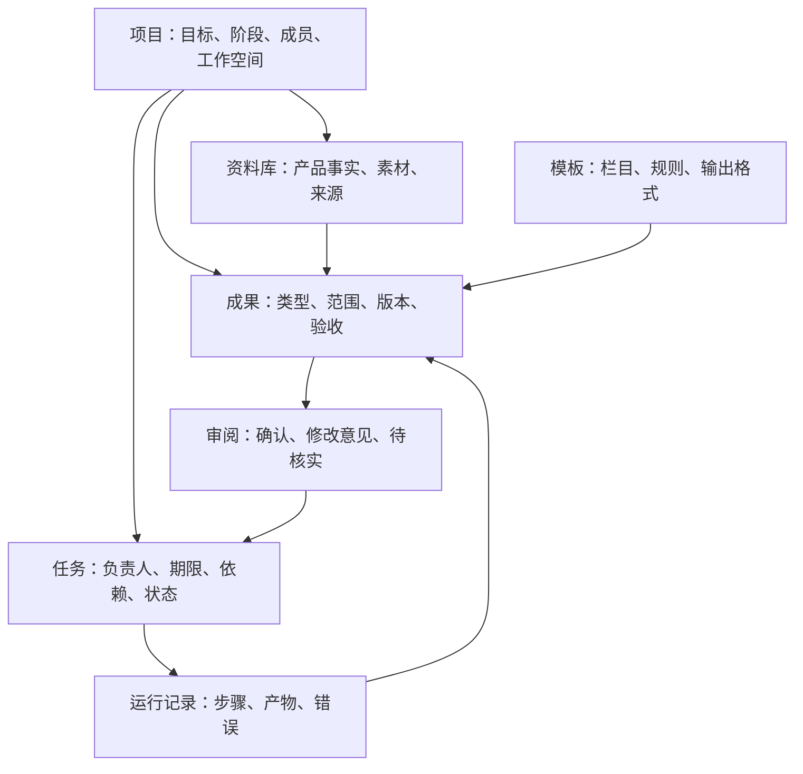

# Jeff 个人工作助理优化方案

日期：2026-10-05。状态：方案待用户确认执行；未修改应用行为，未创建生产任务或修改现有智能体。

## 1. 已确认的产品方向

Jeff 服务于用户自己的高频工作，围绕项目保存事实、组织任务、制作成果、接受审阅并持续推进。

实施顺序：宣传助手 → 项目全过程管理 → 季报/年报。三个阶段使用共同的数据基础，各阶段形成完整可用流程。

| 决策 | 已确认内容 |
|---|---|
| 宣传重点 | 无声智慧病房，以腕表支持病房呼叫、门诊叫号等场景；具体功能以用户资料为准 |
| 销售对象 / 内容主角 | 渠道商与集成商 / 一线医护人员，两个维度独立保存 |
| 使用渠道 | 微信私聊、渠道群转发、现场讲解 |
| 工作方式 | 用户给阶段目标，助手持续推进，每周提交一批计划 |
| 执行环境 | 现有电脑常驻开机、联网并保持 Jeff 运行，App 用于跟进和审阅 |
| 审阅 | 先确认选题与核心卖点，再制作；成品另行验收 |
| 素材 | 建立长期项目素材库；真实素材由用户提供或授权截图，示意图可生成；集中提出缺口 |
| 内容结构 | 先确认完整系统大纲；完整系统 PPT 与单功能视频独立推进，不要求先做完 PPT |
| 制作成员 | 复用用户已有语音合成、绘图、剪辑 Agent，按实际能力绑定 |
| 项目管理 | 立项文档、过程周报、任务跟踪、风险提醒、公司要求的结项文档 |
| 进度来源 | 优先读取思源日报及项目资料，用户确认提取的变更后更新项目事实 |
| 报告机制 | 可复用模板，日期范围与模板分别选择，可扩展月报及其他报告 |
| 不确定信息 | 先出草稿，附来源与疑点，用户确认后成为正式成果 |

## 2. 代码核查与可复用基础

- `apps/desktop/src/renderer/src/App.tsx`、`components/NavRail.tsx`：聊天、智能体、定时、插件、设置导航，现有三栏布局。
- `apps/desktop/src/renderer/src/components/GroupInfoDrawer.tsx`、`packages/core/src/tools/projectTools.ts`：已有项目群任务管理及任务工具，优先扩展而不是新增另一套任务系统。
- `packages/core/src/ipc/contract.ts` 的 `TaskInfo`：已有状态、优先级、指派、父任务；当前接口缺少截止时间、里程碑、证据和成果关联等本方案所需字段。
- `components/WorkspaceFileTree.tsx` 与 `apps/mobile/src/App.tsx`：双端已有工作区文件能力，但需增加任务与成果关联；手机现有文本预览不能视为已支持完整 MP4/PPTX 验收。
- `packages/core/src/cron/`：已有定时触发与独立会话，复用周计划触发基础。
- `packages/core/src/index.ts`：权限请求目前自动放行、模型问题自动拒绝，不能靠新增 UI 就获得可靠挂起。
- `packages/core/src/agents/registry.ts`：小杰禁止 `task`、`jeff_spawn_subtask`，统筹制作宜由普通项目群主承担；部分医疗智能体类别会禁用文件与命令工具，绑定制作成员时必须检查实际工具能力。
- 已查看 `jeff-cornley-work`、`jeff-video-cut` 等技能说明以评估复用；本次没有调用制作脚本。现有季度技能含固定评分及栏目规则，不能直接当作所有报告的通用事实规则。

核查范围为关键代码路径和近期总结，不是完整代码审计或运行界面验收。

## 3. 项目、资料、成果分别建模

继续以现有项目群作为协作入口，以同一 `project_id` 关联项目管理页面。文件存在工作空间，结构化状态由 core 管理；UI、Agent 与定时任务使用同一事实。

业务任务、成果与模型运行分开：一项视频任务可经历脚本、配音、剪辑和返工多次运行；某次运行结束不代表视频验收完成。项目业务阶段也不等同于任务状态。

## 4. 第一阶段：宣传助手

### 4.1 配置与素材库

项目首次配置阶段目标、系统大纲、产品事实、素材目录和制作成员。现有 Agent 由用户绑定，不默认修改其身份或替换技能。

素材登记类型、用途、所属功能、文件或演示地址、来源、是否确认、版本、生成/真实属性。指定目录里的新增文件先作为候选素材，避免把临时草图直接作为已批准素材。截图清单说明场景、界面状态、尺寸和遮挡要求；能访问的演示系统使用现有内置浏览器工具截图，现场设备与拍摄素材集中向用户索取。患者信息须遮挡，示意图不冒充部署案例。

产品事实与图片分开管理：设备照片不能证明某功能已支持。量化效果、接口、部署与合作条件只引用已确认资料，不自行编写承诺。

### 4.2 两条成果线

- **完整系统 PPT**：长期维护的销售介绍成果，覆盖场景与价值、方案全貌、功能、架构、对接和部署等已具备资料的章节。面向渠道商与集成商，使用医护场景说明价值；章节是否保留取决于资料和用户确认。
- **单功能视频**：每条独立设置受众、使用渠道、功能范围、核心卖点、脚本、分镜、配音和验收记录。视频围绕医护场景讲清一个问题及操作过程，不强制与 PPT 等长、同节奏或同批交付。

两者共享系统大纲与资料，但不以 PPT 文件作为唯一事实源。修改产品事实时生成受影响成果清单，用户选择更新；不自动覆盖已验收文件。

### 4.3 每周流程

1. 读取阶段目标、资料版本、已交付内容与未完成任务。
2. 提交一批功能视频选题、PPT 更新建议及集中素材缺口。
3. 用户逐项或整批确认方向，可修改、退回或延期。
4. 已确认且素材就绪的任务进入制作；缺素材只阻塞相关任务。
5. 群主向已有成员派发清晰输入、预期输出和检查条件；各成员保存中间产物并汇报。
6. 交付可查看的成品、采用素材和验证结果；用户验收或提出修改意见。
7. 下一批考虑上批未完任务，避免重复立项或无限积累。

每周具体时间、单批数量、视频时长/画幅、PPT 页数和费用上限放在可编辑配置中，本次没有替用户决定这些数值，也没有创建定时任务。

### 4.4 审阅必须落库

方向确认与成品验收分别记录对象、版本、时间和意见；确认不能仅是聊天中的一句话。修改已确认卖点或范围后，使对应方向确认失效，重新提交。

制作调度在应用层检查确认版本、素材就绪状态与依赖，未通过不得派发制作。核心业务变更由结构化工具校验，防止自动 Agent 自己批准自己的成果；允许普通文件工具的成员不得获得修改控制数据库的权限。此处是项目业务审阅机制，不声称一次实现所有命令、浏览器及外部服务动作的通用审批。

执行中保存运行记录与产物清单，失败重试优先复用已完成步骤。对付费绘图/TTS 等动作，无法确认成功与否时先核查已有产物，不能盲目重复扣费。重启后重建任务状态并核查遗留运行，不能承诺所有工具在任意时刻都能无缝续跑。

通知仅针对待确认、集中素材缺口、阻塞/失败及成品待验收；同一事件去重，不每一步弹通知。暂停项目计划、停止当前运行和取消每周计划是三个明确动作。

## 5. 双端界面与交互

桌面新增项目工作区入口；聊天和现有三栏继续保留。项目列表显示目标、阶段、下一里程碑、阻塞与待审数量。项目内使用：概览 / 任务 / 资料与素材 / 成果 / 模板；各阶段逐步开放对应能力，避免空入口。

成果页将完整系统 PPT 常驻显示，视频按功能组织；显示内容范围、方向确认、素材缺口、运行状态、成果版本及审阅动作。任务详情提供关联对话与文件，保留工具步骤供需要时查看，概览优先展示业务阶段。

App 增加项目与待审入口，可查看任务、素材缺口、方向摘要和成果，支持确认、退回及修改意见。通知进入具体项目/任务/成果，电脑离线时明确展示最后更新时间与缓存状态；离线审批不展示成功，联网后重新确认版本。手机上传素材是需要实现的新能力，不假定现有照片发送已覆盖素材归档。

手机验收至少支持 MP4 播放与 PPT 各页预览；桌面保留 PPTX 原文件，手机可下载/分享或调用系统打开，分享由用户操作。PPT 预览转换是实现时需验证的能力，现有环境若缺转换器，须在编码阶段验证可行路径，不将 PPTX 文件存在当作手机验收通过。

## 6. 第二阶段：项目全过程管理

- 立项：配置项目及公司模板，生成立项草稿、目标范围、里程碑与任务分解，确认后建立基线。
- 执行：在既有任务表与工具上扩展截止日期、依赖、阻塞、证据与验收条件；负责人同时区分实际业务负责人和执行 Agent，不把公司的同事伪装成智能体。
- 日报导入：保存思源来源、读取范围和原文快照/版本，提出任务新增、进度变更、风险与疑点。重复读取不得重复建任务；用户逐项或批量确认后更新正式状态，日报里的“开发中”不能自动标为验收完成。
- 周报：基于已确认进展与来源输出完成、进行中、下一步和风险；未确认内容单列，不混入完成事项。
- 风险：截止时间临近、逾期、依赖阻塞、材料缺失等明确规则先行，展示触发事实和建议，避免仅靠模型猜测。
- 结项：按公司要求配置交付清单及模板，核查任务、文档与验收证据；缺项时输出待补清单，用户确认后结项归档。

## 7. 第三阶段：可扩展报告

模板定义用途、栏目、聚合规则、统计字段、疑点处理、预览与输出格式，并保存版本。报告实例记录模板版本、来源集合、实际日期范围和项目过滤条件。月报、季报、年报是报告预设，不是三条硬编码流程。

思源文档首次配置通过搜索列候选，用户确认文档/范围后保存绑定；不猜 ID，不在确认前把搜索命中自动当作输入。此后在已授权范围内重复读取，新增来源须重新确认。

按原始日报范围统计，合并同一工作的持续进展，不通过拼接季报生成年报；每项总结可追溯来源，日期归属有疑义时标记。草稿与正式版本分开，更新日报后生成新草稿，不覆盖已批准报告。

复用现有康立季度技能的表格和公式能力，其固定自评分策略须显式作为模板配置展示，不能把自动评分当作来源事实。工时、业绩与完成率等没有依据时留空或标待确认。

输出格式按实际模板指定：例如季度考核表需要 Markdown 预览与带公式 XLSX；公司立项/结项可能需要 DOCX；不能强制所有成果统一格式。

## 8. 实施边界与验收

第一阶段可拆为三个实现单元：① 项目资料、成果、业务审阅及双端入口；② 成员派发、成品预览与返工；③ 每周计划、去重通知及重启恢复。全部通过验收才称宣传助手已交付，不把目录或静态页面当作完成。

| 阶段 | 必须验证的结果 |
|---|---|
| 宣传 | 同一项目独立完成系统 PPT 和单功能视频；复用已有制作成员；未确认方向不得派发制作；缺素材只阻塞相关任务；两端审阅一致；重启和重试不重复建批次、覆盖成品或无条件重做付费步骤 |
| 项目管理 | 从立项到结项跑完；重复导入日报不重复建任务；任务变更须用户确认；周报引用事实；风险显示原因；缺结项材料不得静默视为齐全 |
| 报告 | 同一份日报用不同模板生成季报与年报；通过配置新增月报；重复记录去重、来源可追溯、疑点保留；Excel 公式及公司版式有效 |

代码变更遵循仓库要求：core 与远程契约同时更新；新结构化配置进入现有同步合并，不新增独立配置备份按钮；目录素材沿用目录备份原则，密钥不入备份；手机缓存/传输通过现有密文链路，中转站不解析业务内容。素材视频大小及远程传输需专门测试，不能经现有文本 IPC 无上限塞入。

每个涉及桌面行为的实现任务收尾跑单测、类型检查、mock UI、v18、cron；聊天/工具/群协作/定时链路增加真实模型验收和服务端事实断言；双端新增交互和成品预览均需实测。按仓库规则统一 bump，并产出 deb、exe、APK 与产物校验；MINOR 需另获用户确认。当前只交方案，不 bump、不打包。

第一期聚焦常驻本机执行、文件成果交付和用户审阅；公开平台自动发布与云端独立执行不纳入本期。公司模板、产品文件、演示地址与已有 Agent 的选择是实现/配置时输入，不能阻止先搭建功能，也不能在缺输入时编造正式成品。

## 9. 参考与取舍

- [Multica Agents](https://multica.ai/docs/agents)：身份、工作及运行区分，结果回写工作空间。借鉴任务与运行分离。
- [Manus 2.0 / Cue](https://help.manus.im/en/articles/17190150-what-is-new-in-manus-2-0)：角色团队与手机跟进。借鉴现有成员协作，保留用户决策。
- [Grok Bot](https://docs.x.ai/grok-bot/overview)：持久上下文、协作、流程复用。借鉴成功流程沉淀，执行沿用本机。
- [Dots Tasks and memory](https://learn.chatgpt.com/docs/dots/tasks-and-memory)：持续职责、按变化通知、运行完成不等于结果达标。借鉴待审与验收模型。

以上是基于公开文档的设计取舍，没有对这些产品做账户内实测，也不宣称 Jeff 已有其云端能力。

## 10. 待执行确认

请用户确认：是否按照本方案从第一阶段宣传助手开始实施。确认后继续遵循阶段顺序，不因新消息只完成宣传而遗忘后续项目管理与报告；各阶段交付后汇报验收结果。此确认不包含尚未决定的定时运行时间、付费额度或产品功能承诺。
