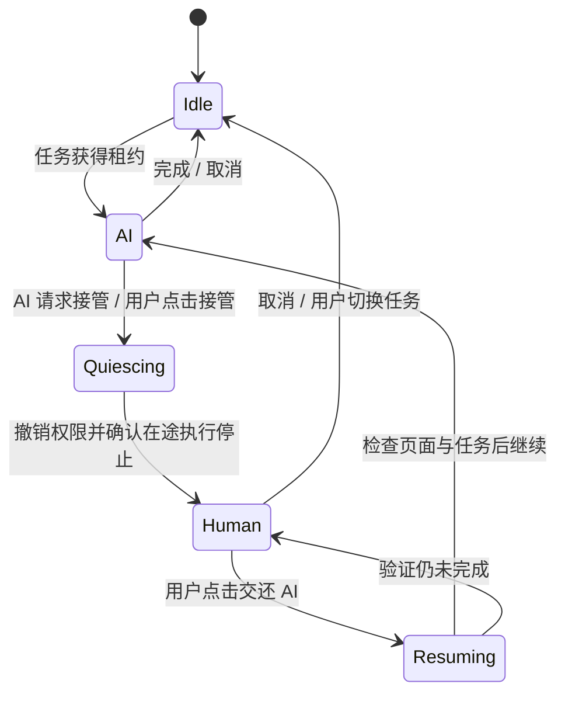

# Jeff 内置浏览器接管与采集稳定性方案

调研日期：2026-10-08。状态：已按七轮访谈及用户最新范围修订，待用户确认执行；未获代码实施授权。

## 用户目标

- 调研 ChatGPT / Codex 中仅与内置浏览器相关、值得 Jeff 借鉴的功能。
- 网站采集遇到登录、验证码等阻塞时，让用户手动接管内置浏览器；用户完成后交还 AI，继续原任务。
- 评估内置浏览器其他优化点。
- 使用 `grill-me`（实际转调 `grilling`）逐题收敛需求，给出技术与测试验收方案，再询问是否执行。

## 已确认的决策

1. **通用接管**：AI 可以请求用户接管，用户也可以主动接管；覆盖登录、验证码、扫码与其他难操作页面。
2. **暂停范围**：暂停占用浏览器的原任务；阻止所有 Agent 通过 Jeff 浏览器接口读取、截图和操作当前浏览器；其他不使用浏览器的会话继续工作。
3. **共享方式**：第一期保留单浏览器，当前任务独占到完成或取消；其他任务等待，用户可以主动切换任务。
4. **长期等待**：持续保留“等待用户”，跨退出与重启保留；永不按超时自动夺回浏览器，重启后由用户明确继续。
5. **Android 范围**：手机显示等待状态、网站与原任务，提供提醒、返回原会话与取消；网页登录和实际操作在桌面完成。
6. **登录凭据**：用户明确不需要保存密码，以本机浏览器登录会话复用为主，常见登录方式是扫码。登录会话过期后重新接管；不新增密码库或凭据同步。
7. **本期范围**：接管闭环、稳定元素定位、动态加载等待。
8. **最新范围修订**：借鉴功能只保留内置浏览器相关项，其他暂不实现；通用目标模式、活动中心、消息排队/纠偏、侧聊、事件触发任务、系统窗口捕获等移出本方案。

## 本期交付范围

| 本期能力 | 用户可见结果 | 必要支撑 |
| --- | --- | --- |
| 人工接管与交还 | AI 遇到阻塞请求用户操作；用户也能主动接管，完成后继续原采集任务 | 独占控制、暂停、原会话续接、持久等待、登录会话复用、敏感内容保护 |
| 稳定元素定位 | 多个相似按钮/输入框时准确操作；页面变化后重新观察 | 当前页面的元素引用、唯一性与过期校验 |
| 动态加载等待 | 等目标内容出现/消失或控件可用后再采集、点击 | 有界条件等待、加载失败与人工接管的中止处理 |

Android 的状态、提醒、原会话定位和取消属于浏览器接管配套。对引擎、群协作、通用任务、定时任务的调整仅用于让浏览器任务正确暂停/续接和排队，不新增通用长任务产品、消息队列入口或新的定时能力。

## 浏览器相关官方参考与候选

下面的 Jeff 建议是本次分析。本期之外的浏览器候选仅供后续选择，不属于本次实施授权。

| 官方功能与资料 | 对 Jeff 的建议 | 本次处理 |
| --- | --- | --- |
| [Browser](https://learn.chatgpt.com/docs/browser)：登录时暂停，用户完成后交还控制 | 接管状态与原任务续接 | 本期 |
| [Browser](https://learn.chatgpt.com/docs/browser)：独立浏览器配置与登录会话 | 复用 Jeff 本机登录会话，过期后重新接管 | 本期基础行为 |
| [Browser](https://learn.chatgpt.com/docs/browser)：浏览器数据与网站权限管理 | 查看/清理站点会话，按站点配置浏览器访问与下载权限 | 后续浏览器候选 |
| [Browser](https://learn.chatgpt.com/docs/browser)：下载位置与保存询问 | 下载结果、文件路径和完成状态可追踪 | 后续浏览器候选 |
| [Browser](https://learn.chatgpt.com/docs/browser)：标签、全屏/分屏、网页评论 | 多标签、专注浏览器视图、选区反馈或将当前页附加到聊天 | 后续浏览器候选 |
| [Browser extension](https://learn.chatgpt.com/docs/chrome-extension)：操作已有登录的浏览器页面 | 连接用户现有 Chrome 等浏览器 | 后续浏览器候选 |

稳定元素定位与动态加载等待来自 Jeff 源码中发现的采集可靠性缺口，是本项目的设计建议，不宣称官方采用相同技术实现。

## 当前源码事实

检查基准：`fb798b8`，仓库版本 `2.0.0`；开始时 `main` 与 `origin/main` 对齐，工作区无改动。

- `packages/core/src/browser/control.ts`：`BridgeBrowserControl` 管理请求和回传，普通动作超时 30 秒，截图和视口调整 120 秒；没有任务所有者、接管状态或请求代次。
- `packages/core/src/index.ts` 的 `registerBrowserTools()`：注册导航、读内容、点击、输入、上传、错误读取、视口与截图工具；当前没有接管工具。
- `packages/core/src/tools/bridge.ts`：外部引擎 MCP 有运行期 capability 绑定调用者；内置 OpenCode 插件经本机 Bearer 接口传 `__ctx`。浏览器所有权不能让模型通过自填 `agent_id` 获得，需从已验证的运行上下文推导，并审查两条工具桥路径。
- `apps/desktop/src/renderer/src/App.tsx` 与 `browserHost.ts`：浏览器请求在 App 层处理，可自动打开面板，没有互斥队列。
- `apps/desktop/src/renderer/src/components/BrowserPanel.tsx`：人和 AI 共用 webview；面板隐藏/关闭会销毁 webview；使用持久分区 `persist:jeff-browser`，但仍需真实验证会话在重启后的行为。
- 同一文件的 `get_content`：元素标签可能使用 `el.value`，没有敏感字段过滤；元素清单上限 80，默认文本 8000 字符；按标签/类型生成的选择器可能匹配多个输入框。
- 同一文件的 `click` / `type`：返回值可能含元素值；密码与验证码保护不能仅处理 `get_content`。
- `apps/desktop/src/main/index.ts`：`window.open` / `_blank` 被重定向到原 webview。依赖 `window.opener` / `postMessage` 的认证可能不兼容，这是需要复现的风险，不能写成已经证实的具体网站故障。
- `apps/desktop/src/main/ipc.ts`：截图还有主进程 CDP 入口，不能只在 React 按钮或工具定义里拦截。
- `packages/core/src/engines/client.ts` / `oc/client.ts`：有中止与会话续用路径，但没有统一的暂停/继续协议；回合总预算目前为 90 分钟。人工等待不能靠把所有工具请求改成无限超时实现。
- `packages/core/src/cron/scheduler.ts`：重启会将残留运行记录收尾为失败；同一定时任务在上一轮未结束时跳过新触发。新增等待用户状态必须显式兼容这些语义，不能误报成功或恢复时重复采集。
- `packages/core/src/remote/whitelist.ts`：当前拒绝手机调用浏览器回传和截图 IPC。新增手机状态/动作需逐项归类，不能直接开放内部通道。
- 浏览器文档写“页面权限请求默认拒绝”，本次对桌面源码搜索未找到 `setPermissionRequestHandler` / `setPermissionCheckHandler`；需要进一步验证实际行为，不能把文档描述当作已实现事实。

## 验收边界与待验证事实

- 接管触发与在途动作边界按下述方案实施，先用引擎真实协议验证暂停及原会话续接路径；不能以工具返回“等待用户”替代实际暂停。
- 用户未指定具体网站；已明确优先扫码与登录会话复用。先设计可重复的扫码/账号密码/会话过期测试站；具体网站兼容性在真实验收中逐站记录，不宣称所有网站可用。
- 不保证网页内存状态跨重启保存：未提交表单、滚动位置和临时认证弹窗可能丢失；持久化的是任务等待记录和可复用的本机登录会话。登录有效期仍由网站决定。

## 技术约束

- 由主进程/核心维护任务归属和接管状态，界面显示同一份事实。
- 浏览器授权按运行/会话/话题区分，不能仅按 Agent 区分；同一 Agent 的私聊与定时任务不可串线。
- 接管切换需要撤销旧请求权限；晚到结果不能恢复 AI 控制、写入错误任务或泄漏接管中的页面。
- 浏览器读取、导航、输入、上传、截图、错误现场以及认证子窗口都要检查状态；人工输入不可走模型工具参数。
- 续接先观察当前页，再决定下一步，不能重放旧的点击、提交或上传。
- 现有不同执行引擎、群流水线、委派与定时任务需要统一识别“等待用户”，而非普通失败或完成。
- 页面内容、Cookie、认证令牌、密码与验证码不进入同步或诊断；本机任务恢复记录仅保留必要元信息。不能宣称接口封锁提供了对同一操作系统用户下任意脚本的安全隔离。

## 技术方案（待执行确认）

### 对象与归属

- **浏览器工作流运行**：一次需要浏览器的用户任务，记录来源（私聊/群话题/通用任务/定时任务）、原会话、原执行引擎、目标、已完成步骤、当前阻塞与下一步。
- **浏览器租约**：由逻辑任务持有，另记录当前操作会话；不能只用 Agent ID，也不能依赖用户当前选中的聊天窗口。
- **人工接管请求**：绑定运行与租约代次，持久化原因类别、创建时间和完成/取消状态；不给模型返回接管期间页面内容。
- **队列**：持久化等待浏览器的运行。等待不占用模型执行或定时调度的并发额度，同一任务仍只保留一个未完成运行。
- 群内委派沿同一逻辑任务转移当前操作会话；同一任务的成员操作仍需串行。子任务不能排在父任务持有的租约后面形成死锁；接管必须暂停所属工作流的后续派发，不只停一个成员的工具调用。

### 状态与流程



队列中的任务单独处于 `waiting_browser`。用户切换任务时，旧任务保留进度并转入等待，新的任务取得新代次租约。切换前提示可能丢失当前未提交网页状态，避免用户将切换误认为完整保存页面。

1. **触发**：增加平铺参数的接管工具，例如 `jeff_browser_request_handoff(reason, category)`。AI 对扫码、验证码或不确定的页面主动请求；本地检测到明确的密码/验证码字段时，在读取或截图前触发保护。用户工具栏随时可接管，空闲浏览器可直接人工使用。
2. **交接中**：先撤销旧代次权限，阻止新动作下发并丢弃晚到结果，结束正在进行的截图采集；再等待当前可中止动作与原运行收敛，界面确认后显示“由你操作”。已经送达网站的提交无法撤回，须记录为已发生/结果待核实，恢复时不得自动重放。
3. **人工操作**：用户直接操作同一网页，Jeff 不记录键入内容，不向 AI 采集 DOM、截图和原始控制台。状态通知只含安全元信息。活动任务期间区分“收起”与“关闭”：收起保留当前页面；明确关闭仍销毁 webview，并保留任务等待记录、提示未提交网页状态的影响。登录检测只返回本地分类结果，不返回输入值。
4. **引擎暂停**：新增明确的暂停结果/原因，与取消、失败和正常完成区分。不要依赖长时间悬挂的 HTTP/MCP 调用；在支持的安全边界结束当前引擎回合，持久化进度，释放运行资源。用户主动接管时先封锁浏览器接口，再请求中断并等待确认；未确认停止时仍显示交接中，不能声称已经暂停。需为每个受支持引擎验证真实停止与原会话续接。
5. **交还**：主进程按请求 ID、租约代次和当前状态原子处理；双击只生效一次。清理人工阶段缓冲，执行本地敏感字段检查后，再将脱敏页面观察返回原会话。按原引擎与原话题发送明确的续接事件；不是重发最初任务，也不是重复执行上次的动作。
6. **恢复**：重启只恢复本机等待记录与可复用的登录会话，不自动启动 AI、不还原浏览器内存和临时弹窗。恢复 URL 只保留安全导航信息，去掉认证回调参数与片段；遇到任务删除、引擎变化、会话失效等情况显示明确原因，不静默换引擎或新建任务。
7. **调度**：等待用户/浏览器是非终态，不生成成功通知，不触发群主提前总结、不开放通用任务验收，也不被重启清理当作失败。同一定时任务等待时新触发继续按原规则跳过，并记录原因；恢复更新同一运行记录。

### 接口与隐私边界

- 主进程维护唯一状态并推送桌面与手机；React 的禁用按钮只是反馈，不承担唯一的权限检查。
- 所有浏览器动作携带服务端关联的运行身份、租约代次和页面代次；排队动作在取得执行权时重新校验，旧选择器不沿用到新页面。
- 浏览器工具不能由模型伪造调用者或释放他人租约；明确审查 OpenCode 插件与外部 MCP 两种身份通路。
- 页面内容读取不再把表单值当作标签；密码、验证码及人工认证输入不进入工具回传。截图前检查当前页面/认证子窗口；仍存在敏感输入时保留人工接管，不能只靠密码视觉上的圆点遮挡。
- 接管期间停止原始错误缓冲采集/持久化；认证 URL 查询参数与 fragment 不发给模型、不写诊断日志、不推送手机。恢复后清理再启动采集。
- 登录会话沿现有本机持久分区复用，不保存用户密码、不导出 Cookie；网站注销或会话过期后再次请求接管。
- 单浏览器意味着后续任务可能使用同一已登录账号，界面须展示当前网站与任务归属；多账号隔离如需支持应另行设计。
- 认证弹窗兼容列为后续浏览器候选，本期记录现有单页跳转的限制。若后续纳入，应使用受控子窗口、共享会话分区、保留标准 opener 回调，与原任务一起封锁 AI 访问；不能通过原页跳转假装弹窗流程可用。[Electron 窗口文档](https://www.electronjs.org/docs/latest/api/window-open)
- 页面权限需要同时核实请求和检查通路，不能仅以文档的“默认拒绝”作为验收。[Electron Session 文档](https://www.electronjs.org/docs/latest/api/session)
- 手机新增查询/取消通道仅返回必要状态；明确拒绝页面内容、认证信息、内部结果回传、截图与实际输入通道。通知点击应精确定位原会话/话题，不抢其他正在查看的会话。

### 稳定元素定位

- `get_content` 返回元素的角色、可访问名称、控件类型、是否可见/禁用，以及本次观察中的 `element_ref`；不用输入值生成标签。
- `click`、`type`、`upload` 增加标量 `element_ref`。引用绑定当前页面与有效 DOM 节点，导航、接管或节点被替换后作废；旧引用返回“重新读取页面”，不按旧序号猜测新节点。
- 保留现有 CSS/文字入口，但操作时必须检查唯一匹配。多个同名按钮或重复选择器不能默认选第一个；返回候选信息，让模型重新定位。
- 不引入新的 Playwright/Puppeteer 运行依赖，沿用 Electron 页面执行能力。已有测试继续使用 Playwright。
- 首期覆盖主文档及可支持的页面结构；跨域认证 iframe、封闭组件等无法可靠定位的内容给出明确限制并请求人工操作，不承诺控制任意页面。

### 动态加载等待

- 增加 `jeff_browser_wait_for`，参数只用平铺标量：元素引用/选择器或文字、条件、超时；条件包括出现、消失、可见、可操作。实现字段与 `allToolDefs()` 同步声明。
- 单次等待默认 10 秒，上限 30 秒，并在浏览器请求超时中预留通信余量。按目标条件探测，不用固定长睡眠，也不要求全站网络静默；持续轮询或 WebSocket 页面同样可用。
- 页面导航/失败、人工接管、任务取消或租约变化立即结束等待，返回不同原因；不得在用户操作期间继续读取页面。
- 等待结束后重新确认目标状态再操作。控件出现不等于业务成功，提交、下载或采集结果仍需按任务要求确认。
- 回归 SPA、延迟列表、加载遮罩、控件从禁用变为可用、持续网络请求以及内容始终不出现的情形。

### 用户界面

- 浏览器工具栏明确显示当前任务、控制者和状态；AI 操作时可点“接管”，交接中禁用重复操作，人工操作时主按钮为“交还 AI”，另提供“取消任务”。
- 原会话中展示接管原因与网站、等待状态、返回浏览器入口。避免把等待用户显示成持续模型生成或发送失败。
- 队列只列需要浏览器的任务；用户切换先保存原任务状态，再换控制者与页面。没有原任务时，用户可浏览网页，交还按钮解释为何不可用。
- 复用现有通知通道，仅在需要接管、恢复失败或任务完成等状态变化时提醒；不新增全局活动中心，不周期性催促。
- 手机显示当前连接电脑、网站、原任务与等待原因，提供返回原会话和取消；不开放远程网页输入或交还控制。

### 预期修改位置

| 层 | 主要文件/模块 | 改动目的 |
| --- | --- | --- |
| 核心浏览器 | `packages/core/src/browser/` | 运行归属、租约、队列、接管状态、持久恢复、动作防竞态 |
| 工具桥 | `tools/definitions.ts`、`tools/bridge.ts`、`index.ts` | 接管工具、身份与生命周期校验、标量参数 |
| 引擎与聊天 | `engines/`、`oc/client.ts`、`chat/private.ts`、`orchestrator/` | 暂停结果、原会话续接、保留流式/工具记录、群与子任务协调 |
| 通用/定时任务 | `tasks/service.ts`、`cron/`、`db/repos.ts`、数据库迁移 | 持久等待状态、运行去重、释放并发额度、重启与运行历史语义 |
| 桌面 IPC | `apps/desktop/src/main/index.ts`、`main/ipc.ts` | 主进程授权检查、CDP 截图保护、页面生命周期 |
| 桌面 UI | `BrowserPanel.tsx`、`browserHost.ts`、`App.tsx`、`store.ts`、聊天状态与样式 | 接管/交还/取消、所有者与等待状态、折叠页面保留 |
| 远程与手机 | `ipc/contract.ts`、`remote/whitelist.ts`、桌面 gateway、`apps/mobile/src/` | 脱敏状态推送、提醒、原任务定位与取消 |

新增恢复记录只存本机，不进入配置同步或独立备份入口；长期数据边界的正式决定在实施阶段记录 ADR。具体数据库设计及引擎暂停适配以协议验证结果收敛，不能将本方案当作已验证实现。

## 测试与验收方案

### 封闭测试与服务端事实

| 场景 | 必须验证的事实 |
| --- | --- |
| AI 请求/用户主动接管 | 控制权转给用户前，原运行已暂停；此后任何 Agent 的浏览器操作与读取均被拒绝 |
| 登录后继续采集 | 测试网站收到有效登录会话，原会话/群话题产出预期采集内容；交还双击只续接一次 |
| 扫码与登录复用 | 本地模拟扫码端确认后浏览器获得会话；下一次任务及重启后有效会话不要求重登；过期后再次接管 |
| 超过旧动作超时/重启 | 人工等待超过 30/120 秒仍为等待用户；重启无模型请求，用户明确继续后恢复同一运行 |
| 多任务与同一 Agent | 私聊、群话题、定时任务不串线；未持有控制权的运行显示等待，其他非浏览器工作继续 |
| 群内委派与定时运行 | 子任务不与父租约死锁；等待释放执行额度，未提前总结/报成功；同一定时任务不堆叠新运行 |
| 竞态、取消、关闭 | 接管时截屏/等待被中止，旧结果被丢弃；取消释放租约，关闭页面保留任务等待状态 |
| 已送达的提交 | 服务端记录提交次数，交还与重启不自动重复提交；结果不确定时重新核实 |
| 稳定定位 | 多个相似按钮准确命中，歧义拒绝；节点替换或导航后的旧引用无效 |
| 动态等待 | 条件满足后继续，超时明确失败；连续网络请求不阻碍条件判定，接管后停止探测 |
| 手机与远程边界 | 加密链路传递正确运行状态与取消结果；内部回传、页面读取/输入/截图通道仍被拒绝 |
| 敏感数据 | 测试密码、验证码和认证令牌不出现在模型输入、工具回传、诊断日志、浏览器截图产物或同步内容 |

测试服务端、临时 home、日志与证据放 `.tmp/browser-handoff/`。真实认证信息不作为测试数据；人工输入期间不保存含秘密的整窗截图，布局证据使用未输入或已清理的页面。

### 真实模型与真实引擎

- 对 OpenCode（Jeff）跑真 sidecar + 真模型接管/续接：先等 `chat-stop` 出现，再以明确的等待状态判断暂停；续接完成后对账 `chat:history` / `group:history` 与服务端结果。
- 对每个受支持引擎验证暂停原因、在途停止与原会话续接协议；已配置且可用的引擎跑真模型，不能用 mock 结果宣称所有 CLI 已通过。缺少认证或协议不兼容时明确报告，不静默替换引擎。
- 至少覆盖私聊、群聊、定时任务以及用户主动在工具执行期间接管。每轮留服务端记录、运行状态与历史 JSON；截图避开人工认证输入阶段。
- 外部网站未指定，不把模拟扫码测试写成真实网站兼容已通过。实施后可由用户在实际采集站点扫码，验收交还后的采集结果；站点限制逐项记录。

### 必跑回归

```bash
npm test
npm run typecheck
npm run test:e2e -w jeff-desktop
npm run test -w @jeff/mobile
cd apps/desktop
npx playwright test -c e2e/playwright.config.ts --project=v18
npx playwright test -c e2e/playwright.config.ts --project=cron
```

另增加具名浏览器接管 E2E 项目和相应单测、手机 instrumentation；涉及引擎与远程状态的现有套件一并回归。根 typecheck 的存量问题先记录基线，包级检查不得新增错误；不以打包成功替代测试。

### UI 与安装版验收

- 桌面窄/中/宽窗口与亮/暗主题，手机 360/390/430 CSS px；覆盖初始、加载、交接中、人工操作、恢复中、排队、失败、取消和长任务名/长网址。
- 检查键盘、焦点、滚动、按钮禁用与状态可访问性；人工目检截图，并核对主进程/数据库真实状态。
- 新增 `deploy/suites/browser-handoff.json` 及对应 Android instrumentation；先 Ubuntu `jeff` AVD，通过后再 Windows USB/网络真机。
- Windows 从实际安装目录、隔离数据目录运行具名套件，核对页面来自安装版 ASAR。Windows 不可达时记录待验收；真机不可用时只写“模拟器通过，真机待验收”。

### 正式构建与校验

代码通过测试后统一 bump 一次，再从同一份最终源码构建三种正式软件：

```bash
npm run package:linux
npm run package:win
cd apps/mobile
npm run cap:sync
cd android
./gradlew --no-daemon assembleRelease
```

- Ubuntu：deb、AppImage、逐文件 ASAR 校验；安装 deb 后核对版本及 `/opt/Jeff` 与 `linux-unpacked` 的 ASAR 哈希，重开确认版本。
- Windows：NSIS PE32 格式、逐文件 ASAR 校验、浏览器接管特征与内置 OpenCode；安装后核对实际 EXE/ASAR 与来源包一致。
- Android：release keystore 签名，版本与仓库一致；用 SDK 35.0.1 的 `aapt` 与 `apksigner` 校验版本、versionCode 和签名。
- 保存三平台产物路径与 SHA-256、实际构建源码提交、测试证据与未完成的真实验收项。本任务不包含 relay 部署。

## 实施顺序与完成门槛

1. **协议验证与状态设计**：确定运行归属、暂停结果和恢复路径；验证各引擎真实暂停/续接及群委派边界，记录本机恢复数据 ADR。
2. **接管闭环**：主进程控制权、持久等待、页面生命周期、桌面 UI 与手机配套；完成登录、扫码与会话过期测试。
3. **采集稳定性**：元素引用与歧义检查、条件等待；保留现有表单、上传、错误读取和截图的回归行为。
4. **验证与交付**：封闭/真模型/UI/远程验收、版本核对、三平台正式构建与安装版校验。

完成必须满足：真实采集任务能经用户接管后继续；等待、续接、排队与取消不串任务、不重复提交；敏感信息保护与手机边界通过；全部必跑项及正式产物校验完成。未完成真实网站、某引擎或 Windows/真机验收时，按实际结果列出限制，不声称该项通过。

## 版本与执行确认

当前版本为 `2.0.0`。本方案提供独立可感知的浏览器接管能力，建议按项目规则升 MINOR 至 `2.1.0`，须在执行前由用户确认；本次纯方案文档不 bump。

用户确认执行后才修改产品代码、运行实施测试和构建安装包。文档确认不等于已经实现。后续浏览器候选也不随本次自动实施。

## 实施状态

仅调研与方案记录；没有产品代码改动，没有执行测试、版本 bump、打包、安装或部署。
