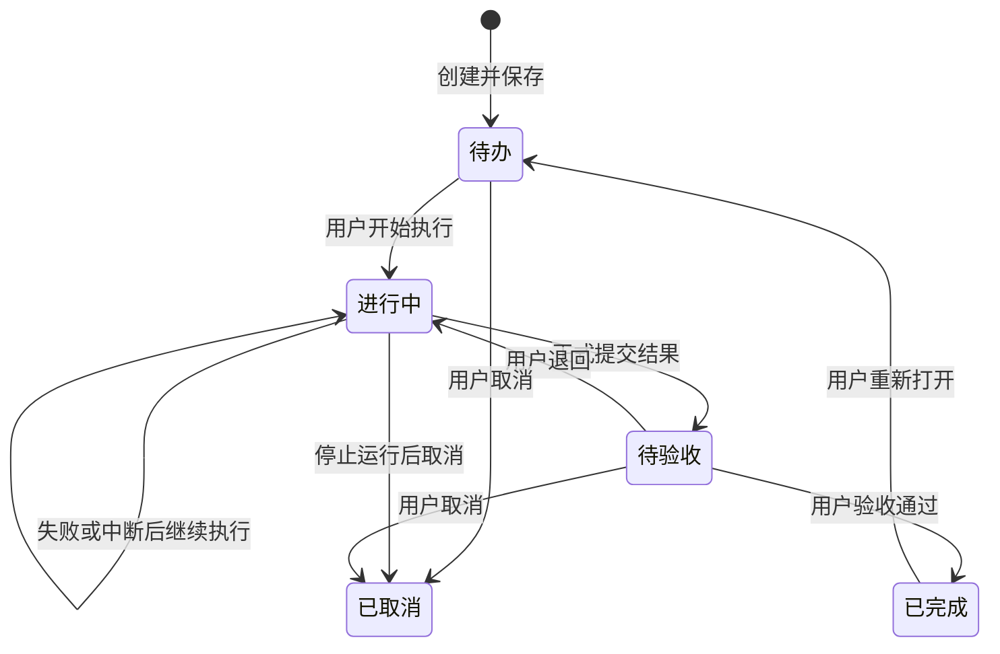

# 项目群通用任务管理与 Prompt 重整技术方案

日期：2026-10-08。状态：方案已认可并实施；自动回归、三平台正式构建、Ubuntu/Windows 安装版 UI 验收、Android AVD 与实体机 instrumentation 已通过。真实模型任务主场景矩阵已覆盖；额外外部引擎探测和手机端真实加密消息回路存在环境/配对限制，详见交付记录。方案讨论时仓库版本：1.12.1；实施版本按破坏性变更升为 2.0.0。

本方案通过 `grill-me` → `grilling` 逐项讨论形成。用户确认采用推荐方案并继续执行。实现范围包括桌面端、Android 端、Prompt、任务服务、旧能力删除、回归和三平台正式构建。

## 1. 已确认的产品边界

1. 删除「项目工作台」及其销售、宣传选题、素材审批等专用业务。用户确认尚未使用、没有保存数据，可以直接删除，不做旧工作台数据归档或迁移。
2. 项目管理面向所有任务。任务提供三个独立、可选的文本域：**目标、任务描述、验收标准**。销售对象等具体业务要求可以写进目标或任务描述。
3. 创建任务只保存。用户点击「开始执行」后由负责人执行；未指定负责人时交给群主协调。
4. 每项任务使用独立话题，执行、委派和继续执行均带入对应任务上下文。
5. 智能体执行后提交结果，进入「待验收」。用户确认才变为「已完成」；用户可退回继续执行。失败、中断必须留下实际原因。
6. 项目群资料保留五个入口：项目管理、群资料、群成员、会话记录、工作区文件。桌面与手机使用一致的数据和状态语义。
7. Prompt 区分个人身份、项目事实、群规则、成员职责、记忆、AGENTS.md 和当前任务要求。各执行路径共用组装逻辑，预览展示实际发送内容。任务要求与持久规则明显冲突时指出冲突，请用户裁定。

## 2. 当前实现核查

以下是对当前源码的静态核查，不等同于已完成真实模型或安装版验收。

| 核查对象 | 当前事实 | 本次处理 |
| --- | --- | --- |
| 桌面群资料 | `GroupInfoDrawer.tsx` 同时维护群配置、工作台表单、选题、素材、报告及任务入口 | 拆分五个通用入口，移除专用业务 |
| 手机群资料 | `apps/mobile/src/App.tsx` 有对应资料、任务、素材、选题、报告分区 | 同步删除专用分区，改为通用结构 |
| 任务字段 | 已有 `description`、`acceptance_criteria`、负责人、期限、依赖和证据路径，没有独立 `goal` | 新增 `goal`，复用已有任务描述与验收字段 |
| 创建任务 | 目前主要是表单保存和状态下拉，未发现项目任务的专用启动服务 | 增加任务执行服务及明确的启动、停止、提交、验收入口 |
| 普通群回合 | `GroupChat.buildBriefing()` 已包含群简介、群规则、当前成员职责及名册；`runTurn()` 另加记忆块 | 保留有效信息，统一结构与作用域 |
| 显式委派 | `Delegator` 使用群 briefing 加记忆 | 改为同一个上下文组装器，透传任务运行身份 |
| 独立子任务 | `SubtaskRunner.buildSystem` 当前接入 `buildMemorySystem()`；未带普通群回合的群资料和职责，模型选项也使用个人设置 | 群内子任务补齐群上下文及群成员模型/思考覆盖 |
| 记忆与 AGENTS.md | `buildMemorySystem()` 已读取用户、Agent、项目记忆及用户级/项目级 AGENTS.md | 不把持久规则统一降为“供参考”，分别标明语义 |
| AGENTS.md 来源 | 项目权威副本优先，缺失才读取工作区旧文件；当前整段读取在一个 `try/catch` 中，失败可能静默漏掉后续来源 | 保留权威来源规则，逐来源记录读取结果，显式显示错误 |
| 工作台阶段目标 | `workspace_state.goal` 用于专用文档生成，没有直接接入普通群 briefing | 删除旧工作台目标；新增目标归属于具体任务 |
| 上下文预览 | `contextPreview()` 的 `system` 当前取自 `buildMemorySystem()`，未包含完整群 briefing 与个人 Prompt | 区分“下一轮拟发送”与“最近一轮实际发送”，展示完整 Jeff 上下文 |
| 任务状态权限 | `jeff_task_update` 可更新状态，通用保存也能传 `done` | 后端阻止模型与普通保存绕过人工验收 |
| 远程通道归类 | `whitelist.ts` 虽声明新增通道应归类，实际 `build()` 最后存在默认 `allow` | 本次新增通道全部显式归类，并用测试直接约束；不能把当前默认分支当作漏项保护 |

主要证据：`packages/core/src/orchestrator/group.ts`、`delegate.ts`、`subtask.ts`，`packages/core/src/index.ts`，`db/repos.ts`，`ipc/contract.ts`，`remote/whitelist.ts`，以及桌面主进程 `apps/desktop/src/main/ipc.ts`。

## 3. UI 与交互方案

### 3.1 五个入口

| 入口 | 首屏和主要操作 | 深入内容 |
| --- | --- | --- |
| 项目管理 | 搜索、状态/负责人筛选、新建任务、任务列表 | 当前任务详情、执行记录、结果与验收 |
| 群资料 | 名称、头像、群简介、群主 | 群规则、工作目录、项目记忆与规则入口；解散群放危险操作区 |
| 群成员 | 可搜索的成员列表、选中成员的职责 | 生效引擎、模型/思考继承或覆盖、添加/移除成员 |
| 会话记录 | 普通讨论与任务话题，明确所属任务 | 历史查看、进入话题；运行中的任务话题禁止删除 |
| 工作区文件 | 已保存工作目录下的实际文件树 | 打开、预览、复制路径；未保存的目录草稿不改变文件树 |

桌面采用宽资料面板；项目管理内部为“任务列表 + 当前任务详情”，窄窗改为逐页进入。手机采用入口列表 → 任务列表 → 任务详情，主要操作固定在可触达位置，不横向压缩桌面表格。

### 3.2 新建与编辑任务

常用字段按顺序展示：

- 任务标题：必填。
- 目标：独立文本域，可选，说明预期结果。
- 任务描述：独立文本域，可选，说明要做的具体工作、材料与要求。
- 验收标准：独立文本域，可选，说明如何判断完成。
- 负责人：当前群成员中选择；未指定明确显示“由群主协调”。
- 更多设置：优先级、截止日期、前置任务。

不内置销售、医疗、宣传或软件开发模板。三个文本域为空时仍可保存和启动；Prompt 标明相应要求未填写，不编造验收条件。需要补充信息时任务进入“需要补充”运行状态，保留问题与继续执行入口。

任务详情分为任务要求、执行记录、结果与验收。状态标签用中文，禁止用一个任意状态下拉承担执行和验收流程。

### 3.3 状态与草稿保护

- 覆盖初始、加载、空、成功、失败、不可用、长内容和未保存状态。
- 任务保存、群资料保存、成员保存使用各自的提交状态，失败保留草稿并显示具体错误。
- 切换任务、成员、群或关闭面板时，对未保存草稿提供“保存并继续 / 放弃更改 / 取消”。不因全局数据刷新覆盖正在编辑的草稿。
- 选项超过 6 个提供搜索；成员采用列表与详情，不同时展开全部配置。
- 桌面窄/中/宽窗口与明暗主题验收；手机覆盖 360、390、430 CSS px。检查键盘、焦点、滚动、裁切和横向溢出。
- 模型和思考分别显示“继承个人默认”和“本群覆盖”，显示当前生效值及恢复继承动作；执行引擎仍属于 Agent 个人配置。
- 项目记忆与项目 AGENTS.md 可以从群资料进入；全局用户记忆与用户级 AGENTS.md 跳到既有记忆设置，并提示影响全部对话。复用原编辑能力，不另建一套文件写入逻辑。
- 备份与恢复只在“设置 → 同步”，本次不新增备份入口。

## 4. 删除范围与兼容边界

删除工作台页及相关销售对象、呈现对象、传播渠道、系统介绍大纲、推进节奏表单；删除该工作台的素材登记/审批、宣传选题版本/方向审批、制作任务生成、成品审核，以及立项/周报/结项快捷生成和嵌入式报告模板业务。

删除范围覆盖桌面、手机、专用 IPC、专用工具定义/处理器、运行逻辑、样式、默认引导、内置使用说明和专用测试。实施时先用引用搜索列出清单，再移除；不得只藏入口却继续在工具或 Prompt 中提供旧业务。

`workspace_state` 不再作为活动业务数据读取、编辑或注入。数据库迁移删除旧列，新业务 DTO、工具与同步导出不再包含它。用户已确认没有保存数据，不编写旧工作台归档或业务迁移。

通用任务、已有实际工作区文件、Agent、项目群、聊天和定时任务保留。通用思源检索/导出、普通技能、文件浏览等若有独立调用方，保留其通用能力；通过普通任务和技能完成报告或宣传，不在项目管理内固化业务。

移除公开 IPC/模型工具涉及兼容性与 SemVer，见第 10 节；不能以“用户尚未使用”为由自动认定不存在公开能力变更。

## 5. 数据结构与同步

### 5.1 任务定义与验收事实

沿用 `task` 主表和 `TaskInfo`，新增字段如下；名称在编码时保持契约、仓储、转换、工具与同步一致。

| 字段 | 类型 / 默认 | 用途 |
| --- | --- | --- |
| `goal` | TEXT / 空串 | 任务目标 |
| `result_summary` | TEXT / 空串 | 最近一次正式提交的结果摘要 |
| `submission_id` | TEXT / 空串 | 当前提交标识，后端生成 |
| `submitted_spec_hash` | TEXT / 空串 | 提交所对应的任务要求版本 |
| `review_feedback` | TEXT / 空串 | 最近一次人工验收反馈 |
| `reviewed_submission_id` | TEXT / 空串 | 用户已经验收的提交标识 |

`description`、`acceptance_criteria`、`evidence_paths` 继续复用。任务要求版本由标题、目标、描述、验收标准、负责人和依赖等执行相关字段的规范化内容计算哈希；不是模型传来的可信版本。状态更新本身不改变要求版本。

验收与提交事件在现有 `task_activity` 中新增 `details` JSON 文本字段，默认空对象，记录提交标识、要求版本、决定和反馈，保留历史而不覆盖旧事件。该表已有同步路径，新增详情须兼容旧记录，并继续按事件 ID 去重合并。

旧任务的 `goal` 等新字段默认空值，保留原描述与验收标准。UI 可显式清空文本；模型 update 的未传/空串仍表示“不修改”，要清空使用明确的 `clear_goal` 等标量参数。负责人取消指派也改为明确动作，避免模型补空误清配置。

### 5.2 本机运行事实

新增本机 `task_run`，至少记录：

- `id`、`task_id`、`project_id`、`thread_id`、实际执行 Agent。
- 运行状态：`queued / running / succeeded / failed / cancelled / interrupted / needs_input`。
- 启动、结束时间，错误类型与可读原因。
- 任务要求快照及哈希、Prompt 组成元信息、提交标识。
- 幂等请求标识，启动来源（桌面用户/已绑定手机用户）。

活动运行在本机按任务唯一。业务状态与运行状态分开：任务可以仍为“进行中”，而最近一次运行已经“失败”，不能把两者混成一个状态。

任务话题映射放本机 `GroupThreadStore`/kv，元数据增加 `kind: discussion | task | cron` 和可选 `taskId`。同一任务在同一电脑继续执行复用自己的话题；不同任务不共用。话题 ID、CLI 会话 ID 和运行快照不经 WebDAV 同步。

### 5.3 同步规则

- 任务定义、结果摘要、验收事实和既有活动事件随结构化同步走。
- 本机运行记录、排队状态、原始 Prompt 快照、CLI 会话和聊天记录不加入 WebDAV。
- 同步导入不能启动任务，不能把另一电脑的“进行中”解释为本机正在运行。UI 区分“无本机运行记录”和“正在运行”。
- 合并后若 `done` 对应的提交/验收标识或要求版本不匹配，不展示为有效完成，回到待验收并说明版本变化。旧格式任务采用明确兼容标记，不伪造历史人工验收记录。
- 多台电脑的 WebDAV 不是分布式执行锁。本次只保证同一执行电脑防重复；跨电脑同时启动不承诺全局互斥，执行记录须标识所在电脑。
- 保留现有软删除墓碑与设备工作目录策略；任务内容属于用户主动填写的结构化资料，沿用现有同步约定，凭据和运行日志不新增到同步 payload。

## 6. 执行、停止与人工验收

### 6.1 服务端入口

新增 `TaskService`（建议 `packages/core/src/tasks/service.ts`），统一被桌面 IPC、手机远程调用和模型工具使用。状态校验与调用者权限集中在该层，避免 UI、IPC、工具各实现一套。

拟新增契约：

| IPC | 调用方式与行为 | 远程策略 |
| --- | --- | --- |
| `task:start` | 用户启动；校验后尽快返回 `runId`/排队状态，异步运行 | 已绑定手机允许 |
| `task:stop` | 按任务与运行 ID 精确停止，不调用全群无差别停止 | 已绑定手机允许 |
| `task:runs` | 查询这台电脑的任务运行记录 | 已绑定手机允许 |
| `task:submit` | 正式提交结果；校验运行、任务版本及证据 | 已绑定手机允许用户提交；模型走专用工具 |
| `task:review` | 人工通过/退回；携带提交标识与版本 | 已绑定手机允许；不暴露为模型工具 |

已有 `task:save` 只保存资料与允许的手动流转，不能直接设置 `done`。启动、验收和停止接口不能通过客户端自报 `actor=user` 获得权限；桌面 IPC、远程网关及工具桥分别提供真实调用来源。

工具补齐目标与清空参数，新增受约束的任务结果提交能力。Agent 可创建、编辑、查询和提交任务；“开始执行”由用户入口触发，Agent 不获得伪造人工验收或自动启动其他任务的路径。不能绕过 `jeff_task_update`、`task:save`、创建时状态或通用管理工具把任务标为已完成。

### 6.2 启动流程

1. 服务端读取已保存任务，校验未删除、所属项目、负责人为当前成员、前置任务已完成、要求版本仍匹配。
2. 指定负责人优先；未指定使用有效群主。负责人已移除时明确要求重新选择，不静默改派。运行需要的引擎不可用时保留任务，给出实际原因。
3. 同一事务中认领本机活动运行并创建/复用任务话题。双击、手机重试和两个窗口重复启动返回同一活动运行，不生成两个流程。
4. 沿用现有按项目串行执行锁，UI 显示排队；不扩大成任务并行执行，以免共享工作区写入冲突。等待期间可取消，轮到执行前重新检查任务、成员与依赖。
5. 扩展群执行内部参数 `taskId / taskRunId / targetAgentId`，通过真实 ID 路由，不把负责人姓名拼成 `@` 文本来驱动首回合，避免同名或任务正文提及误路由。
6. 显式传任务 `threadId`，创建时不改变用户当前活跃话题。用户点击“查看执行”才进入该话题。手打群消息、定时任务和其他任务均维持原所属话题。
7. 成员委派和子任务继承任务运行身份及快照。TaskService 持有外层生命周期，工具调用不能只凭当前活跃群窗口猜任务。

指定负责人场景应能直接执行；现有群流水线强制群主的检查需拆分，不能在已经明确负责人时仍因“无群主”阻止首回合。只有确需群主协调或总结时才校验群主，并如实处理缺失状态。

### 6.3 提交与验收



- 模型请求正常结束不等于完成工作。没有正式提交时保留进行中，并提示“本轮结束，尚未提交验收”；需要补充信息时保留问题。
- 提交必须有非空结果摘要；证据路径可为空，因为部分任务成果就是文本。填写路径时校验工作区相对路径、实际存在及符号链接边界，不能凭模型宣称存在。
- 提交绑定服务端识别到的任务运行和要求快照，不允许模型提交其他任务或冒充其他成员。
- 一次运行最多一个当前有效提交；重复提交幂等。提交可先记录，外层协作未结束时不允许验收；后续委派或总结失败时保留提交但标明流程失败，不能显示为完整成功。
- 人工验收核对当前提交、任务要求版本、前置任务和活动运行。过期页面的“通过”请求返回冲突，保留用户意见，不覆盖新版本。
- 正在运行时任务要求以只读展示为主；要修改先停止，保存后再次启动。完成后修改目标、描述、验收标准等要求，先显式重新打开，不能沿用旧验收。
- 用户退回填写反馈，保留原结果与记录；“继续执行”携带反馈和已提交成果，而不是从零丢失上下文。
- 异常、超时、引擎退出、用户停止与取消分别落库。应用重启把悬空活动运行标为中断，不自动重发，避免重复写文件。
- 删除任务或任务话题前检查活动运行；运行中不能直接删除。停止只作用于对应任务运行，不能误停普通群讨论或定时任务。

## 7. Prompt 组装与可验证性

### 7.1 单一组成模型

新增 `packages/core/src/prompt/context.ts`，以结构化块表达上下文。建议块包含 `kind / scope / source / content / contentHash / readStatus`；输入包含 Agent、项目、话题以及可选任务运行身份。

各引擎序列化相同的组成结果。Agent 个人 Prompt 在当前引擎的 Agent 配置或指令载体中仅注入一次；不能既在完整 `system` 中加入，又由 `EngineClient` 再拼一次。外部引擎继续使用已有隔离配置目录，不把 Jeff 生成内容写回用户真实工作区 AGENTS.md。

| 组成块 | 语义 | 注入范围 |
| --- | --- | --- |
| 个人 Prompt | 稳定身份、能力、风格 | 当前 Agent 的各类回合 |
| 用户级 AGENTS.md | 跨项目持久规则 | 私聊、群聊、委派、子任务 |
| 项目级 AGENTS.md | 当前项目持久规则 | 当前项目的群回合及派生任务 |
| 群简介 | 项目背景事实，不当作自动派发命令 | 当前群及其派生回合 |
| 群规则 | 群内协作约束与流程 | 当前群及其派生回合 |
| 当前成员职责 | 责任、交接和权限边界 | 当前成员在当前群的回合 |
| 成员名册 | 可协作对象及本群职责 | 当前群；子任务只保留工作所需信息 |
| 用户/Agent/项目记忆 | 长期事实与偏好，明确各自来源 | 按对应作用域 |
| 任务目标 | 本任务希望达成的结果 | 任务话题、委派与派生子任务 |
| 任务描述 | 本任务具体工作和材料要求 | 同上 |
| 验收标准 | 本任务完成条件，缺失则明确未填写 | 同上 |
| 运行反馈 | 用户退回意见、当前提交与子任务指令 | 当前运行或继续执行 |

普通群聊不批量注入全部任务；任务话题必须根据持久映射识别任务，不能靠标题或模型输出猜测。项目 A 的规则、职责和任务不进入私聊或项目 B。技能仍按现有机制按需加载，不把全部 SKILL.md 正文常驻塞进 Prompt。

### 7.2 顺序、冲突和读取

- 稳定身份与规则在前，项目事实与职责随后，记忆明确标成事实/偏好，任务要求与本轮指令最后。标题解释用途，避免把所有来源都放在“供参考”下面。
- 当前明确要求可以覆盖记忆中的旧偏好；背景资料中的描述不自动变成硬约束。对任务要求与持久规则的明显冲突，说明冲突来源并提问；本次不实现声称能完整理解自然语言的规则优先级判定器。
- 群规则、成员职责和项目 AGENTS.md 各自保存到原有对象，不自动相互复制；职责不写回个人 Prompt。
- 每轮重新读取已保存的规则与成员配置；任务要求来自该运行的冻结快照。已发送的回合不被后来编辑追溯修改，继续执行使用新运行快照。
- AGENTS.md 沿用“项目权威副本优先，缺失才回退旧工作区”的规则；权威文件存在但为空不再回退旧文件。
- 分来源区分未设置、文件不存在、读取失败和已注入。已存在规则文件读取失败时给出错误，不静默省略后照常执行。
- 注入块有边界和完整性标识；超预算时显式报告哪些内容未进入，不静默截断持久规则与验收标准。避免无依据地常驻全部历史、所有任务或全部技能。
- 工具提交、验收权限、任务隔离等由代码保证，不依赖模型遵守文字说明。模型识别到语义冲突也必须有可复现测试证据，不宣称模型永远能识别全部冲突。

### 7.3 每条执行路径对齐

| 路径 | 需要对齐的内容 |
| --- | --- |
| 私聊 | 个人 Prompt、全局规则、Agent/用户记忆；不得含群身份 |
| 普通群回合 | 群事实、规则、职责、项目规则与对应记忆 |
| 任务负责人回合 | 完整群上下文加当前任务快照 |
| 群内流水线成员与总结 | 当前成员职责与相同任务运行身份 |
| `jeff_delegate` | 从真实会话解析话题、任务及运行；使用同一组装器 |
| `jeff_spawn_subtask` | 私聊/群作用域准确继承；群内补齐资料、职责、规则和任务；沿用群成员模型/思考覆盖 |
| 定时群消息 | 普通群上下文；只带该定时消息，不误带用户正在查看的任务 |
| OpenCode（Jeff/系统）及外部 CLI | 相同语义块，个人 Prompt 不重复；按已有适配器生成隔离配置 |

### 7.4 上下文预览和留证

预览明确区分“下一轮拟发送的 Jeff 上下文”和“最近一轮实际发送的 Jeff 上下文”。来源列表显示作用域、注入状态、字符数与版本，展开查看正文。没有实际运行时不伪称已有发送记录。

实际发送前保存本机快照：任务/话题/Agent/引擎、块哈希、版本及适配器提交的 Jeff 指令内容。仅代表 Jeff 提供的部分，不宣称可以查看 CLI 或提供商隐藏的内部指令。快照不参与同步；常规日志只写组成元信息，不打印私有记忆、令牌或完整敏感 Prompt。

测试采用隔离数据中的唯一标识，核对组装块、最终发送参数或配置文件、模型行为和落库结果四层事实，不能只看预览 DOM。

## 8. 实施模块与顺序

| 步骤 | 主要文件 / 模块 | 交付检查 |
| --- | --- | --- |
| 1. 契约与数据 | `db/db.ts`、`db/repos.ts`、`ipc/contract.ts`、`sync/engine.ts`、`remote/whitelist.ts` | 任务目标、提交/验收事实、运行记录、旧任务/同步兼容；IPC 明确分类 |
| 2. 执行领域服务 | 新增 `tasks/service.ts`；`index.ts`、`orchestrator/group.ts`、`groupThreads.ts` | ID 路由、幂等、串行排队、话题隔离、停止与恢复、服务端验收 |
| 3. Prompt 整理 | 新增 `prompt/context.ts`；群聊、私聊、委派、子任务及引擎适配 | 单一组成逻辑、继承与作用域、完整预览与发送快照 |
| 4. 通用 UI 原型 | 拆分 `GroupInfoDrawer.tsx`、重做 `ProjectTaskBoard.tsx`，整理 mobile `App.tsx` 对应分区 | 先检查五入口、列表/详情、移动端流程及完整状态，再接服务端 |
| 5. 真数据接入与清理 | 桌面 IPC、两端 store/API、任务工具、使用说明、旧工作台模块/测试 | 保存重读、执行与验收落库；所有专用业务引用清除 |
| 6. 验收与交付 | 单测/E2E、真实模型、具名部署集、三平台正式产物 | 按第 9、10 节完成；不能以打包代替功能验收 |

编码前记录任务生命周期与本机运行/同步边界的 ADR，更新 `CONTEXT.md` 和相关说明，避免将任务误写成个人身份或定时任务。纯文档阶段无需建立部署连接或读取签名口令。

## 9. 测试与验收方案

### 9.1 单元与契约测试

新增有业务意义的任务服务和 Prompt 作用域测试，扩展现有 `repos`、`group`、`subtask`、`agentsmd`、`engines`、`tool-args`、`remote` 和 `sync` 测试。

必须覆盖：

1. 三文本域分别保存/读取/清空，空目标兼容，旧任务描述和验收标准保留；两端及工具字段一致。
2. 负责人/群主 ID 路由、同名 Agent、失效成员、无可用引擎；不得因任务描述含其他 `@名字` 改变首回合执行人。
3. 两端重复启动、活动运行唯一、排队取消、重启中断、准确停止；任务 A 不影响任务 B、普通讨论或定时话题。
4. 前置依赖、跨项目依赖、循环依赖及启动/验收时重新检查。
5. 正常回复不自动完成；提交、反馈、失败与中断落库；模型和通用保存不能写 `done` 或伪造人工来源。
6. 过期验收、重复验收、改要求后旧验收失效、提交绑定运行、证据文件存在与路径边界。
7. 私聊无群污染，项目/任务互不串线；委派、流水线、子任务均收到正确职责及任务要求，群内子任务继承模型/思考覆盖。
8. AGENTS.md 权威/旧来源/空文件/读失败；个人 Prompt 仅一次；实际发送快照与预览对账，下一轮拟发送不冒充历史实际发送。
9. 同步新增字段、旧记录缺字段、墓碑、活动事件去重；运行/话题/快照不随同步迁移，导入不启动任务，过期提交不恢复有效完成。
10. 本次全部 IPC 显式远程归类；已删除专用工具与 IPC 不再可调用；通用思源/技能能力不受无关删除影响。

### 9.2 封闭 UI 与真跨进程测试

已新增 `project-tasks-context` 具名部署测试集与桌面 UI 运行器，覆盖通用三字段分别保存、保存不触发执行、群规则/成员职责进入真实 Prompt context。它和核心任务服务测试验证负责人/群主路由、提交、退回与人工验收边界；真实模型矩阵已对负责人执行、群主委派、子任务、作用域隔离、退回继续、冲突、停止/恢复及引擎上下文完成服务端对账。额外引擎与手机真实加密聊天链路的限制见第 11、12 节。

桌面覆盖三档窗口、明暗主题、长文本、多个成员和任务、空/加载/失败/未保存/不可用状态；手机覆盖 360/390/430 CSS px、返回栈、掉线/重连、重复点击和正在编辑时的数据推送。截图必须目检；只断言按钮存在不算通过。

旧 `ui.spec.ts` 和 `v18.spec.ts` 中的工作台/选题/截图审批用例按确认删除的能力移除，保留与新通用任务相关的依赖、文件与隔离测试。新增替代用例在更改旧测试前明确业务依据，不把实际功能失败改成宽松断言。

### 9.3 真实模型验收

测试台与模型凭据放 `.tmp/`，使用隔离 home、工作区和测试文件。至少完成以下 8 类场景：

| 场景 | 服务端验收事实 |
| --- | --- |
| 有负责人执行 | 实际首回合 Agent、当前任务三字段、真实产物、提交和待验收状态 |
| 无负责人执行 | 群主收到同一任务上下文，委派成员有正确职责和任务快照 |
| 显式委派与独立子任务 | 子回合收到指定规则标识和群成员配置，产物/数据符合要求 |
| 作用域隔离 | 同一 Agent 的两个群、两个任务及私聊标识不混入 |
| 退回继续执行 | 用户反馈进入新运行，修正后的文件内容正确，旧结果和事件保留 |
| 规则冲突与需要补充 | 回复指出具体冲突/问题，任务未自动完成或越过验收 |
| 停止、失败与恢复 | 真实工具/引擎中断，错误事实落库，不停止其他话题，不自动重发 |
| 引擎与手机链路 | OpenCode（Jeff）完成基准链路；可用外部引擎按实际能力逐个验证；手机操作同一电脑真实任务并对账 |

每轮先等 `chat-stop` 出现，再等 `chat-send` 返回；针对后台任务另等 `task_run` 明确结束事实。核对聊天 `text/reasoning/tools`、模型工具实参、任务与活动数据库、实际文件以及 Prompt 快照。保存截图和去敏数据证据，不能把模型一句“已完成”当成功。

### 9.4 所有开发任务必跑回归

```bash
npm test
npm run typecheck
npm run test:e2e -w jeff-desktop
npm run test -w @jeff/mobile
cd apps/desktop
npx playwright test -c e2e/playwright.config.ts --project=v18
npx playwright test -c e2e/playwright.config.ts --project=cron
```

另跑本次具名任务/上下文测试与相关引擎、远程链路测试。失败先区分产品、测试台和环境，并留证；不跳过必跑项，不修改断言凑绿。版本统一 bump 后重新跑版本一致性校验。

## 10. 版本、正式产物与安装验收

本任务包含旧工作台公开界面、IPC 和工具能力的删除。根据项目 SemVer 规则，这属于破坏性变更，实施统一升为 2.0.0；用户已认可整体推荐方案。版本号在必跑测试后统一更新所有清单，再执行版本一致性测试。

测试通过后冻结最终源码，同一版本、同一份构建输入依次构建：

```bash
npm run package:linux
npm run package:win
cd apps/mobile
npm run cap:sync
cd android
./gradlew --no-daemon assembleRelease
```

Android 使用已有 release keystore，口令只通过环境变量传入，不进入命令记录、仓库或证据。依赖与签名环境在开发阶段早预检，relay 不因本次打包而部署。

| 平台 | 正式产物与必须完成的检查 |
| --- | --- |
| Ubuntu | `.deb` 与 AppImage；逐文件 ASAR 校验；实际安装版本；安装目录与构建 ASAR 一致；五入口和任务完整流程、相关真实模型链路 |
| Windows | NSIS `.exe`；PE32 Nullsoft 与内置 OpenCode；逐文件校验 unpacked 及安装器内部 ASAR；安装目录版本/哈希；从真实安装目录运行具名任务/上下文用例 |
| Android | `apps/mobile/android/release/jeff-<version>.apk`；`aapt` 版本/包名/版本码；`apksigner` 签名；先 Ubuntu AVD instrumentation，再 Windows USB/网络真机；真实回复、Markdown 与加密落库兼容 |

`deploy/suites/project-tasks-context.json`、Windows GUI 运行器和 Android instrumentation 均已落地。完整的同一任务部署验收已运行：

```bash
npm run deploy:windows -- --target win11 --android auto --suite project-tasks-context
```

Ubuntu 实装核对 `dpkg` 版本和 `/opt/Jeff/resources/app.asar` 与 `linux-unpacked` 的 md5；Android 的 `versionCode = major * 10000 + minor * 100 + patch`，使用 SDK build-tools 35.0.1。Windows 的 SSH、交互用户、锁屏、安装范围与任务权限尽早预检，保护日常活跃进程。

产物清单记录真实构建提交、版本、大小、SHA-256。ASAR 失败保留坏包、定位并完整重建，不修补归档后充当正式产物。验收日志、截图与 manifest 放 `.tmp/deploy/<运行编号>/`，总结中逐平台写明通过/失败/未验证及实际范围。Windows 离线或真机缺席只能准确报告待验收，不能扩大为三平台安装通过。

## 11. 完成标准与本轮状态

实施完成必须同时满足：旧工作台及专用能力清理、五入口真数据 UI、三任务字段全链路、负责人/群主执行、运行与话题隔离、后端人工验收约束、Prompt 分层与实际发送对账、必跑回归和真实模型、三平台正式构建及产物校验、可用设备上的安装与具名功能验收，并记录无法自行恢复的外部环境限制。

源码实现、自动回归、结构化 Prompt context、逐轮本机 Prompt 快照、2.0.0 版本一致性、三平台正式构建、Ubuntu/Windows 安装版 UI 验收、Ubuntu AVD 与 Android 实体机 instrumentation 均已完成。真实模型覆盖负责人直跑、群主协调委派、子任务、作用域隔离、退回继续、冲突、停止/恢复及 Codex 外部引擎；额外引擎探测和手机端真实加密消息回路仍有下述环境限制。逐项证据与产物哈希见 [`docs/summary/20261008/项目群通用任务管理与Prompt重整.md`](../summary/20261008/项目群通用任务管理与Prompt重整.md)。

剩余未验证范围：本机 OpenCode（系统）未能完成真实任务，Cursor 当前配置不支持独立 thinking 档位，Claude 当前环境无可用订阅；它们不影响已通过的 Jeff OpenCode 与 Codex 路径。实体 Android 安装、任务表单 instrumentation 和安装冒烟已通过，但手机现有配对桌面离线，因此没有改动日常绑定去做真实加密聊天回路。其余已通过项不能替代这些明确未验范围。

## 12. 实施结果与验收状态

- 任务、Prompt、群资料和同步模块按本方案实现；桌面与移动 UI 使用同一任务服务和状态语义。
- 当前最终回归：`npm test` 的 core 425 项通过、17 项跳过；Relay 11 项通过；`npm run typecheck` 通过；桌面 UI 2/2、v18 4/4、cron 11/11、多引擎/群资料 3/3、配对 2/2；移动单测 29/29、浏览器 E2E 24/24。部署/ASAR 测试更新后 11/11 通过。
- 真实模型：隔离矩阵覆盖指定负责人直跑、未指定负责人由群主委派、独立子任务、群/私聊作用域隔离、退回继续、冲突处理、停止与恢复、Prompt 快照和引擎路径。群主委派因模型对“协调者”字段的中文格式化导致第一次断言过严；保留成员 ID、委派工具、计算结果、任务提交与待验收等严格服务端断言后复跑 1/1 通过。额外外部引擎探测中 Codex 成功；OpenCode（系统）返回执行失败，Cursor 不接受当前 `thinking=low` 覆盖，Claude 环境无可用订阅。
- 正式产物：Linux `.deb`、AppImage、Windows NSIS `.exe`、Android release APK 均为 2.0.0；Linux/Windows ASAR 各 13,802 项、逐文件校验 0 失败，ASAR SHA-256 相同。APK 包名 `app.jeff.mobile`、`versionName=2.0.0`、`versionCode=20000`，`apksigner` v1/v2 验证通过。
- Windows：从实际安装目录启动 2.0.0，在隔离 `JEFF_HOME` 中完成具名任务和 Prompt-context UI 验收；sidecar running、OpenCode 1.18.30。运行 ID 为 `2026-10-08T130759-709Z`，截图与安装信息位于对应 `.tmp/deploy/` 目录。
- Android：Ubuntu `jeff` AVD 的 `MobileProjectTaskBundleTest` 1/1 通过；实体设备 `192.168.3.121:5555` 通过同一 bundle instrumentation 1/1，物理安装冒烟 `MobileInstallSmokeTest` 3/3。当前设备所绑定的日常桌面离线，未改动绑定，因此真实加密消息兼容回路未验。
- Ubuntu：正式 `.deb` 已安装，`dpkg-query` 显示 `install ok installed 2.0.0`。`/opt/Jeff/resources/app.asar` 与最终 `linux-unpacked` 归档 md5 都为 `1b501775a31ea1a561a3ac37945dd6da`；从 `/opt/Jeff/jeff-desktop` 在全新隔离 `JEFF_HOME` 启动，具名任务/上下文 UI 通过，sidecar running、OpenCode 1.18.30。截图和 `app:info` 位于 `.tmp/deploy/linux-installed-acceptance-final-20261008/evidence/`。
